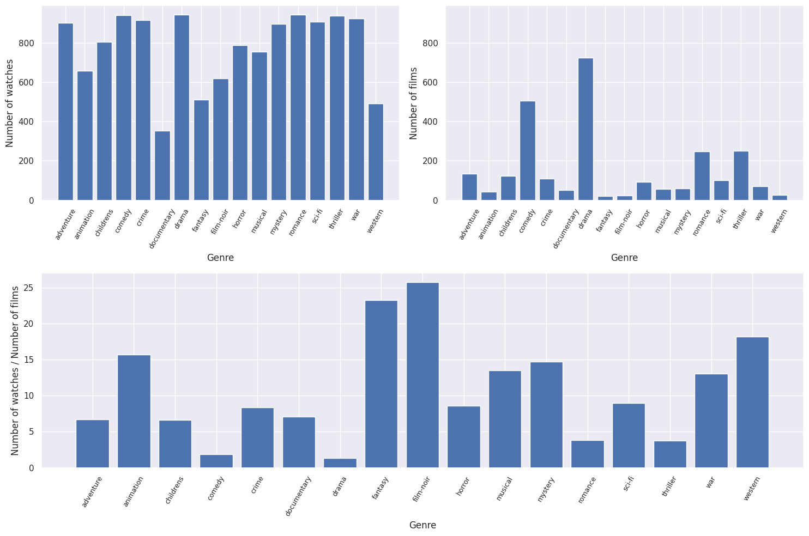
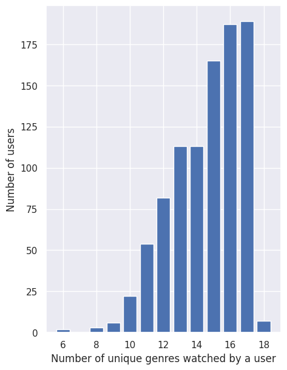
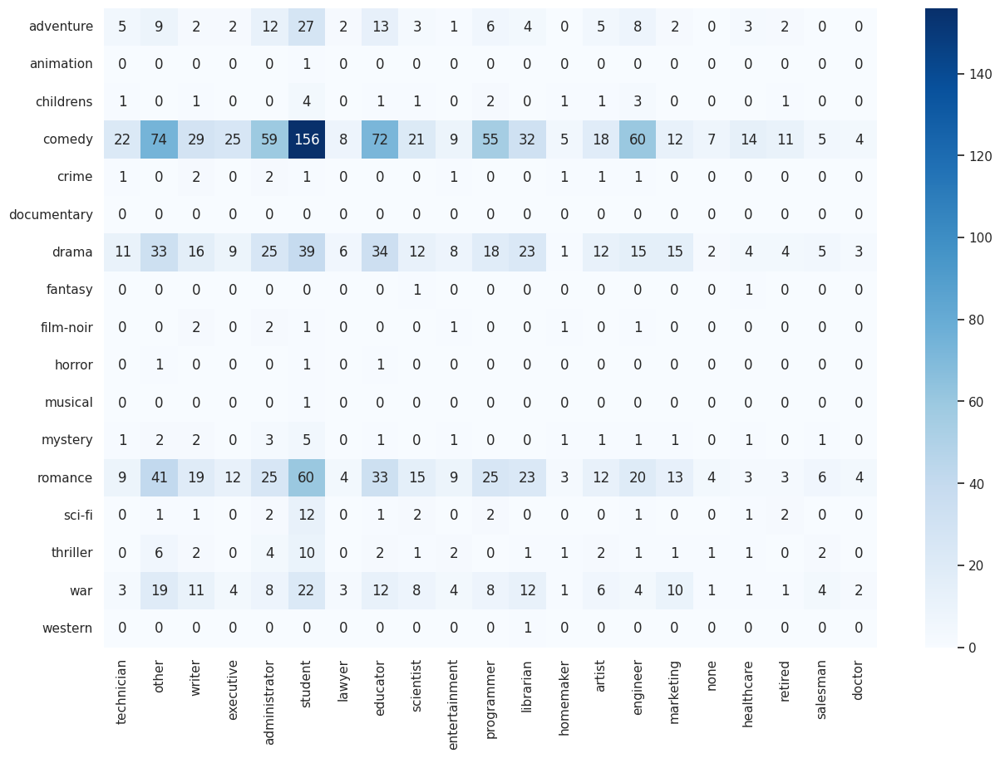
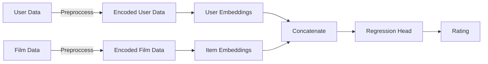
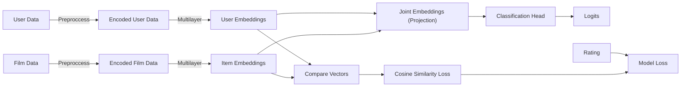
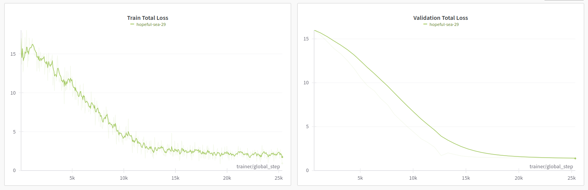
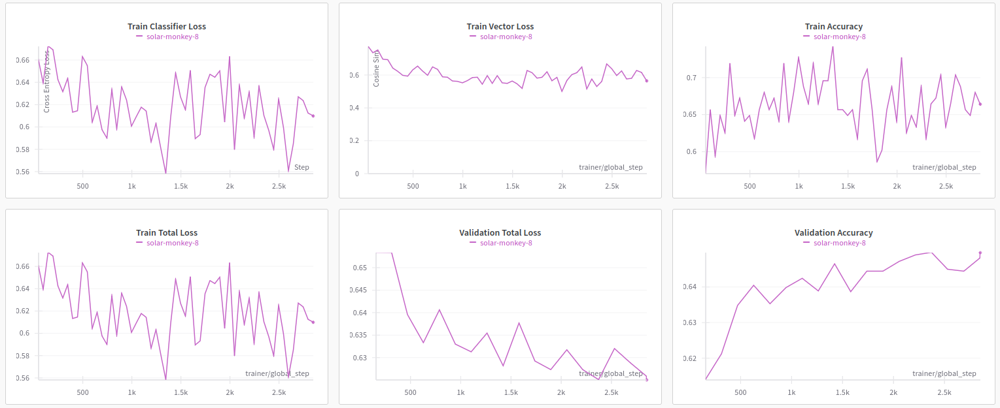
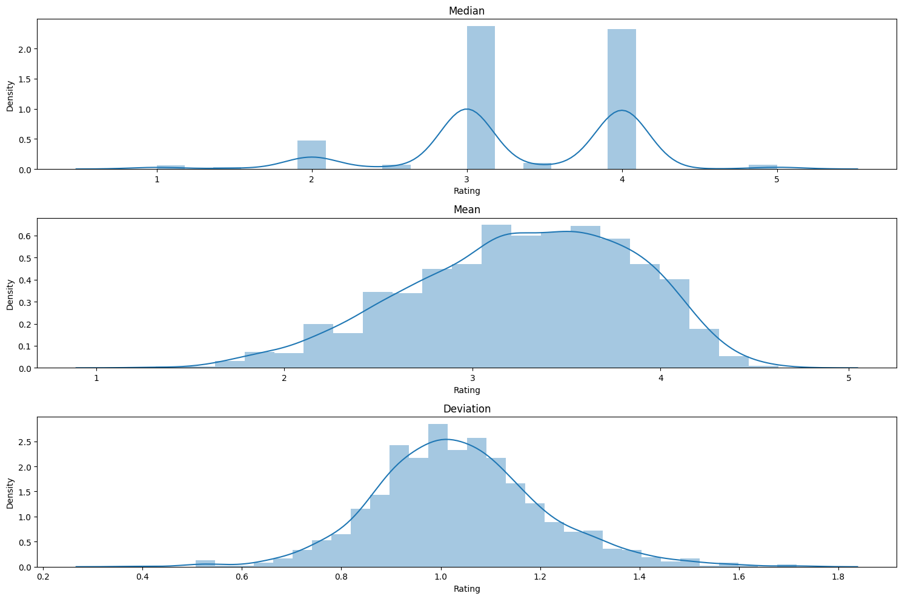

Aleksandr Lobanov | B20-AI | a.lobanov@innopolis.university

# Introduction
This report details the development of a recommendation system for the MovieLens 100K dataset using a deep learning approach. The dataset, consisting of 100,000 movie ratings by various users, provides a valuable source for exploring the dynamics of user preferences in the context of movie recommendations.

The implemented solution is a regular feed-forward neural network, designed to transform user and movie data into a latent space. This approach allows the model to capture the complex interactions between users and movies, revealing underlying patterns that are not immediately apparent.

The problem is treated as a regression task, with the objective being to predict the ratings a user might assign to a given movie.This report will cover the architecture of the neural network, the data preprocessing and feature engineering steps undertaken, the training and evaluation methodologies, and the outcomes of the model. Challenges encountered during the project and the strategies employed to overcome them will also be discussed, along with key learnings and insights gained from applying deep learning to a recommendation system.

# Data analysis

The Data Analysis chapter of this report delves into the systematic examination of the MovieLens 100K dataset. This section outlines the exploratory data analysis (EDA) conducted to gain fundamental insights into the dataset’s characteristics, such as user behavior patterns, movie attributes, and rating distributions

## Distribution of Genres

The first step in the EDA process was to examine the distribution of genres in the dataset. The dataset contains 19 genres, with each movie being assigned to one or more genres. The following figure shows the distribution of genres in the dataset.

    

So as you may see, watches are not distributed evenly across genres. The most popular genres are Drama, Comedy, Thriller and Romance. The ratio of watches over films also varies significantly. For example, the ratio of watches to films in the Film-noir genre is close to 25, while in the Drama, which is the most popular genre, this ratio is a little more than 1. 

## Genres Watched by Users

Another interesting question is how many different genres users watch. The following figure shows the distribution of the number of genres watched by users. 

    

As you may see, users tend to watch many different genres. That leads to the conclusion that the user's preferences are not well defined by genres.

## Occupation x Genre

As we are extremely limited in number of attributes, we wish to analyze the most detailed one - occupation and genre. The following figure shows the distribution of genres watched by users of different occupations. A number in the cell represents the number of watches of a particular genre by users of a particular occupation.

    

The distribution is also very uneven. For example, students tend to consume all genres, while other occupations are more selective. Only a single librarian watched a film in the western genre.

### Conclusion

Exploring the dataset revealed that the distribution of watches is uneven. Some genres are more popular than others. Users also tend to watch many different genres. The distribution of watches by occupation is also uneven. Some occupations are more selective than others. All this leads to the conclusion that the given dataset is very sparse and the recommendation task is difficult to solve with the given data.

# Model Implementation
The assignment required the implementation of a neural network to develop a recommendation system for the MovieLens 100K dataset. The model was designed to predict the ratings a user might assign to a given movie, based on the user and movie representations learned by the model. The model was implemented using the PyTorch framework, and the code was written in Python.

Two models were implemented for this project. The first model was a two tower neural network, which was designed to transform user and movie data into a latent space. The second model is more advanced and uses deeper transformations layers and different technique of joining user and movie representations. Also it is trained on classification task predicting films that users most likely watch. Another models were also implemented, but they were not used in the final solution. For example, I tried to use sophisticated approach of processing films watched by user as a sequence, but it did not give any improvement and made the algorithm of recommendation much more complicated. 

## Model Architecture

### Two Tower Neural Network

The first model implemented was a two tower neural network, which was designed to transform user and movie data into a latent space. The model consists of two towers, one for processing user data and one for processing movie data. The user tower consists of a series of a single fully connected layer, followed by a batch normalization layer and a ReLU activation function. The movie tower consists of a series of a single fully connected layer, followed by a batch normalization layer and a ReLU activation function. The output of each tower is a vector of the same size, which is then concatenated and passed through a regression head to produce the final rating prediction.

The model was trained using only Regression Task and MSE Loss.

### DNN with Multi-Layer Embeddings

The second model implemented was a DNN with Multi-Layer Embeddings. The model consists of two towers, one for processing user data and one for processing movie data. The user tower consists of a series of a single fully connected layer, followed by a batch normalization layer and a ReLU activation function. The movie tower consists of a series of a single fully connected layer, followed by a batch normalization layer and a ReLU activation function. The output of each tower is a vector of the same size, which is then **projected to the same space** and passed through a classification head to produce the final prediction. Unlike the previous model, this model is also trained on Cosine Similarity Task to produce similar embeddings for users and movies to enable the vector search and considers the classification task rather than regression. Any rating above or equal to 4 is considered as a positive example, and any rating below 4 is considered as a negative example. The model is trained on a binary cross-entropy loss.

# Model Advantages and Disadvantages

| Model | Advantages | Disadvantages |
| ----- | ---------- | ------------- |
| Two Tower Neural Network | Simple architecture, easy to train | Does not produce similar embeddings for users and movies, so it makes vector search impossible and thus the recommendation process is not very efficient |
| DNN with Multi-Layer Embeddings | Produces similar embeddings for users and movies, so it makes vector search possible and thus the recommendation process is more efficient | More complex architecture, more diffucult to train, requires much more data to fit the task well. Classfication verdict is less detailed than rating. |

# Training Process

Unfortunately, the dataset is very sparse, so it is very difficult to train the model well. The following figure shows the training process of the both models. The training process is very unstable and the model does not converge well. 

## Two Tower Neural Network

    

The model was trained on MSE Loss and Regression Task. The model was trained for 25 epochs. The best model was selected based on the validation loss. The best loss on the validation set was 1.21. The model was trained on the following parameters:

| Parameter | Value |
| --------- | ----- |
| hidden_dim|512|
item_dim|20
lr|0.0001
user_dim|25
weight_decay|0.000001

## DNN with Multi-Layer Embeddings

    

The model was trained on Cosine Similarity Loss and Classification Task. The model was trained for 7 epochs. The best model was selected based on the validation accuracy. The best accuracy on the validation set was 0.64. The model was trained on the following parameters:

| Parameter | Value |
| --------- | ----- |
| dropout|0.2|
embedding_dim|512
gamma|0.0001
hidden_dim|512
item_dim|403
joint_dim|512
lr|0.001
user_dim|25
weight_decay|0.000001

Gamma is a weight of the Cosine Similarity Loss. It was chosen experimentally.

# Evaluation

To evaluate the model, the dataset was split into training and validation sets by randomly selecting 20% of the users and their corresponding ratings for the validation set. The remaining 80% of the users and their ratings were used for training. 

The evaluation metric used to assess the performance of the model was the mean squared error (MSE) between the predicted ratings and the actual ratings or accuracy of the classification task. Metrics used to assess the performance of the recommendation system were mean average precision (MAP), recall at k (R@k), and precision at k (P@k). The model was evaluated on top 25 recommendations.

# Results

| Model | Val Loss | MAP | R@25 | P@25 |
| ----- | -------- | --- | ---- | ---- |
| Two Tower Neural Network | 0.61 (CE) | 0.0009 | 0.0088 | 0.0085| 
| DNN with Multi-Layer Embeddings | 1.21 (MSE) | 0.0017 | 0.0179 | 0.0188

The results produced by both models are very poor. After evaluating models on the validation set, I collected a number of statistics to understand the reasons for such poor results. The following table shows the mean, median, and standard deviation of the number of watches vs. the rating for each film. 

    

It can be seen from statistics, that most of the films have bad ratings which are very unstable and uncorrelated with the number of watches. This leads to the conclusion that the dataset is very sparse and the algorithm of recommendation is very difficult to train well.